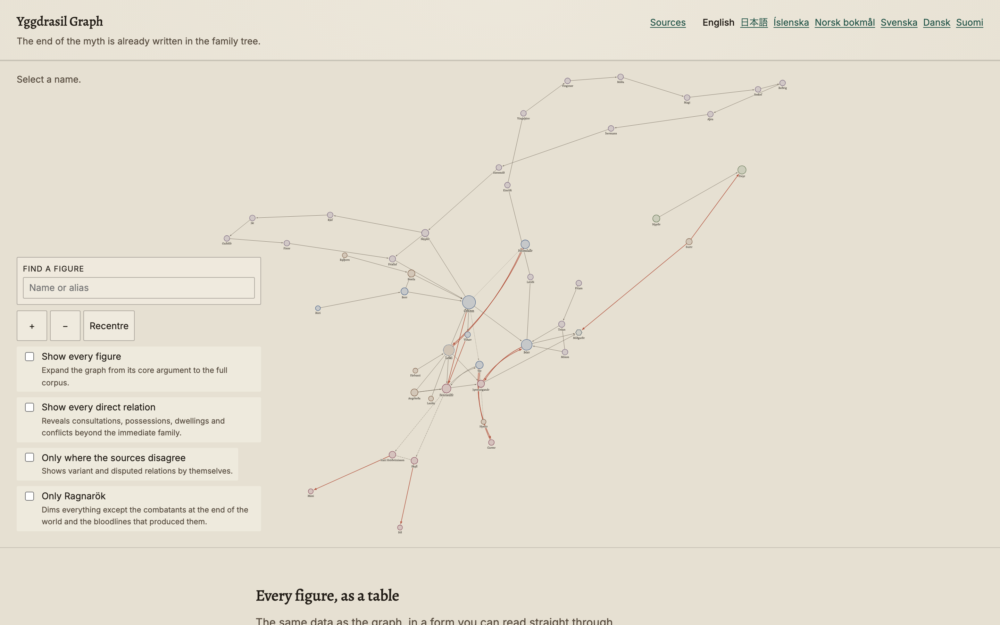

# Yggdrasil Graph

An interactive relationship graph of Norse mythology. Gods, giants, monsters,
the nine worlds and named things are nodes; kinship, enmity, ownership, marriage
and location are edges. Select a figure and the graph narrows to its
neighbourhood, with every relation traced to a chapter or stanza in a
public-domain edition of the _Poetic_ or _Prose Edda_.

**The ending of the myth cycle is already encoded in its genealogy.** Isolate
Loki's descendants and you recover most of the opposing side at Ragnarǫk —
Fenrir against Óðinn, Jǫrmungandr against Þórr, Hel commanding the dead.

Not an encyclopaedia with a graph bolted on — a machine for noticing
structure, built to be checked: where sources disagree, the graph shows both
readings instead of picking one.

<!--
  SCREENSHOT PLACEHOLDER
  Drop a 1440×900 capture of the graph at docs/screenshot.png and replace this
  comment with:  
  Capture the default view, not a selected state — the cold open is the point.
-->

**Live:** _not yet deployed — see [Deploying](#deploying)._

---

## Quickstart

```bash
git clone https://github.com/OWNER/yggdrasil-graph.git
cd yggdrasil-graph
nvm use          # Node version is pinned in .nvmrc
npm ci
npm run dev
```

`npm run dev` compiles `data/` into `src/generated/graph.json` and starts Astro
on <http://localhost:4321>.

| Command                 | Does                                                      |
| ----------------------- | --------------------------------------------------------- |
| `npm run dev`           | Local dev server                                          |
| `npm run build`         | Validate data, compile the graph, build to `dist/`        |
| `npm run validate`      | Check `data/` integrity — **run after every data change** |
| `npm run i18n:check`    | Compare every locale's keys against `en`                  |
| `npm run check:strings` | Fail if a user-facing string is hardcoded in a component  |
| `npm run check:glyphs`  | Fail if a shipped font cannot draw Old Norse              |
| `npm run deploy`        | Build, then `wrangler deploy`                             |

---

## How the data works

Everything under `data/` is hand-edited JSON that compiles to a single graph at
build time. There is no database and no API; the whole dataset ships as static
files. Full detail is in [`docs/data-model.md`](docs/data-model.md).

**Entities** live in `data/entities/`, one file per group:

```jsonc
{
  "id": "loki", // stable, lowercase, never renamed
  "type": "deity", // deity | being | world | artifact | place | event
  "classes": ["aesir", "jotnar"], // an entity may hold several — Loki holds both
  "names": { "non": "Loki", "anglicized": "Loki" },
  "attestations": ["poetic-edda", "prose-edda"],
  "tags": ["ragnarok-participant", "loki-kin", "shapeshifter"],
}
```

No prose lives in entity files. Descriptions are in
`src/i18n/locales/<locale>/entities.json`, so they can be translated. The Old
Norse name is the exception: it is the historical name and is identical in every
language.

**Relations** live in `data/relations/`, one file per family:

```jsonc
{
  "id": "loki--fenrir--parent_of", // always <from>--<to>--<type>
  "from": "loki",
  "to": "fenrir",
  "type": "parent_of",
  "directed": true,
  "certainty": "attested",
  "sources": [
    { "work": "gylfaginning", "locus": "34" },
    { "work": "skaldskaparmal", "locus": "16" },
    { "work": "hyndluljod", "locus": "42" },
  ],
}
```

### Certainty is a feature, not metadata

| Value        | Means                                                           |
| ------------ | --------------------------------------------------------------- |
| `attested`   | The source states it outright.                                  |
| `implied`    | The source entails it without saying it.                        |
| `variant`    | Another source gives a different account of the same thing.     |
| `disputed`   | The sources actively contradict each other.                     |
| `unverified` | Believed true, no locus confirmed. `sources` **must** be empty. |

The graph draws all five differently — dash pattern and opacity, not colour
alone — and there is a filter for showing only the contested ones.

The seed dataset's sharpest example: Gylfaginning 27 gives Gjallarhorn to
Heimdallr, and Gylfaginning 15 has Mímir drinking from it. One work, two owners,
no reconciliation. Both edges are in the graph, each pointing at the other.

### Never invent a citation

Unknown locus → `certainty: "unverified"`, empty `sources`, an entry in
[`data/TODO.md`](data/TODO.md); `npm run validate` enforces all three. Full
rationale in [`CLAUDE.md`](CLAUDE.md#never-invent-a-citation).

---

## Contributing

The most valuable contribution is **adding or correcting a cited relation**, and
[`CONTRIBUTING.md`](CONTRIBUTING.md) uses exactly that as its worked example. If
you know _Skáldskaparmál_ better than you know npm, that guide is written for
you: you can open an issue with a citation and never touch the code at all.

- [Add an entity](../../issues/new?template=add-entity.yml)
- [Correct a relation](../../issues/new?template=correct-relation.yml) — citation required
- [Translate](../../issues/new?template=translation.yml)
- [Report a bug](../../issues/new?template=bug-report.yml)

Also read [`CODE_OF_CONDUCT.md`](CODE_OF_CONDUCT.md).

---

## Roadmap

This first release is a walking skeleton, staged deliberately. Shipped:

- [x] 49 entities and 76 relations, every locus verified against the edition cited
- [x] JSON Schemas and a validator that fails on every integrity rule
- [x] Interactive graph — prerendered, zooming, selecting, filtering, keyboard-traversable
- [x] Entity panel with relations grouped by family and full citations
- [x] Prerendered `/entity/<id>` pages for every figure
- [x] English complete; Japanese as a real locale (see below)
- [x] Accessible table view, `prefers-reduced-motion` support
- [x] CI and deploy workflows
- [x] Unit tests for the pure core logic (`src/graph/model.ts`,
      `src/graph/geometry.ts`, `src/i18n`) — `npm test`, `node:test` via `tsx`.
- [x] Resolved most of [`data/TODO.md`](data/TODO.md)'s gaps and both
      `unverified` relations (deleted, not softened — neither held up under a
      full-text search)
- [x] Japanese (`ja`) fully translated — `entities.json`, `relations.json`
      and `ui.json` all render natively; `ja` is `complete` in
      `src/i18n/config.ts`.
- [x] Structured data (JSON-LD) on entity pages
- [x] The Ragnarǫk overlay — a control that dims the graph to the terminal
      pairings and traces each combatant back through the genealogy that
      produced them.
- [x] Tag-driven "you might also want" suggestions at the end of each panel —
      _also contested_, _also present at Ragnarǫk_, _also a shape-shifter_.
- [x] URL state — selection, filters and the Ragnarǫk overlay serialized to
      the query string, so a shared link reopens the exact view.
- [x] Finnish (`fi`) added as a partial locale — `ui.json` is translated;
      `entities.json` and `relations.json` still fall back to English.

Not built yet, roughly in the order it's worth picking them up:

- [ ] **next up** — Finish translating `fi/entities.json` and
      `fi/relations.json`, then promote `fi` to `complete`.
- [ ] **after that** — Icelandic, Norwegian Bokmål, Swedish, Danish, in that
      order. Routing and font plumbing already handle all of them.
- [ ] **The full 300–400 entity dataset.** [`data/TODO.md`](data/TODO.md) lists
      what is missing and why each gap matters.

---

## Deploying

Static assets on Cloudflare Workers. No Worker request handler, no database, no
runtime API calls — `wrangler.toml` deliberately has no `main` entry.

```bash
npm run deploy
```

CI deploys on push to `main` via `cloudflare/wrangler-action@v4`. Two repository
secrets are required:

| Secret                  | What it is                                        |
| ----------------------- | ------------------------------------------------- |
| `CLOUDFLARE_API_TOKEN`  | A scoped API token with **Workers Scripts: Edit** |
| `CLOUDFLARE_ACCOUNT_ID` | Your Cloudflare account id                        |

Never commit a token. Set both under **Settings → Secrets and variables →
Actions**.

---

## Licensing

**The split is deliberate, and it matters if you want to reuse any of this.**

| What                                                                               | Licence      | File                           |
| ---------------------------------------------------------------------------------- | ------------ | ------------------------------ |
| All source code                                                                    | MIT          | [`LICENSE`](LICENSE)           |
| The dataset in `data/` (and `src/generated/graph.json`, which is compiled from it) | CC BY-SA 4.0 | [`data/LICENSE`](data/LICENSE) |

Code is MIT for unrestricted reuse. Data is CC BY-SA so corrections flow back
rather than disappearing into a fork.

Attribute the data as: _Yggdrasil Graph dataset, CC BY-SA 4.0_, with a link back.

---

## Sources

Citations point at chapters and stanzas in these public-domain editions. Their
text is **not** reproduced anywhere in this repository — the dataset cites them,
and each entity page links out.

- **The Poetic Edda**, translated by Henry Adams Bellows, The American-Scandinavian
  Foundation, 1923. [Project Gutenberg #73533](https://www.gutenberg.org/ebooks/73533)
- **The Prose Edda** by Snorri Sturluson, translated by Arthur Gilchrist Brodeur,
  The American-Scandinavian Foundation, 1916.
  [Internet Archive](https://archive.org/details/proseedda00snor)

Chapter and stanza numbering **differs between editions** — the Bǫlþorn/Bestla
stanza is Hávamál 141 in Bellows and 140 in several other numberings. A locus is
only meaningful with its edition attached, which is why `data/sources.json`
records the translation for every collection. If you check a citation against a
different edition and it does not line up, that is expected; say which edition
you used when you report it.

Never paste text from a modern copyrighted translation into this repository.

---

<!--
  FOR THE MAINTAINER — apply these under Settings, then delete this block.

  Description (350 char max):
    An interactive relationship graph of Norse mythology, built from cited
    primary sources. Every edge points at a chapter or stanza in a public-domain
    edition, and where the Eddas contradict each other the graph shows both
    readings instead of picking one.

  Topics:
    norse-mythology, mythology, poetic-edda, prose-edda, knowledge-graph,
    graph-visualization, d3, d3-force, astro, typescript, cloudflare-workers,
    static-site, open-data, digital-humanities, medieval-literature,
    old-norse, i18n, accessibility

  Also worth enabling: Discussions (the issue template config links to it),
  and a branch protection rule on `main` requiring the CI check to pass.
-->
